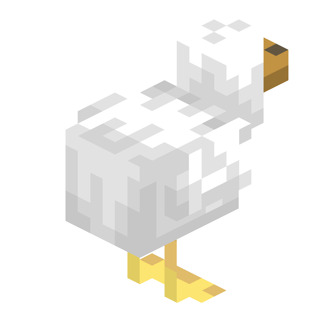

# Quack

  

Quack is a library datapack that provides a couple of functions to do math on quaternions.

### What are quaternions?
Quaternions are an extension of complex numbers which can be used to describe 3D rotations. A quaternion consists of four numbers, whose meaning cannot be comprehended by us mortals. Nevertheless, they are quite useful.

### What does this have to do with block game?
Quaternions are already used in Minecraft for the `left_rotation` and `right_rotation` in the `transformation` of [Display Entities](https://minecraft.wiki/w/Display). You can use this library to calculate those quaternions from the rotation of an entity, for example. Or you could implement your own motion system that does not suffer from [gimbal lock](https://en.wikipedia.org/wiki/Gimbal_lock) for a custom entity or similar.

### Available operations
At its current state, Quack provides the following basic operations:
- Converting [Euler angles](https://en.wikipedia.org/wiki/Euler_angles) to a quaternion
- Multiplying quaternions (aka rotating quaternion a by quaternion b)
- Converting a quaternion to Euler angles

### How to use
Quack has several function you can call under `/function quack:api/*`. Functions that are not in the `api` folder are used for the underlying implementation and should not be called by your datapack.

> [!NOTE]
> Before you can use Quack you need to set up the required scoreboard, which can be done by `/function quack:api/create_scoreboards`. You may want to add this function to `#minecraft:load`, but Quack does not do so by default so that you can choose for yourself.

You can use either numbers in scoreboards (`/function quack:api/scoreboard/*`) or data storage (`/function quack:api/storage/*`) as inputs and outputs for Quack. The storage functions are simply wrappers that call the scoreboard function.